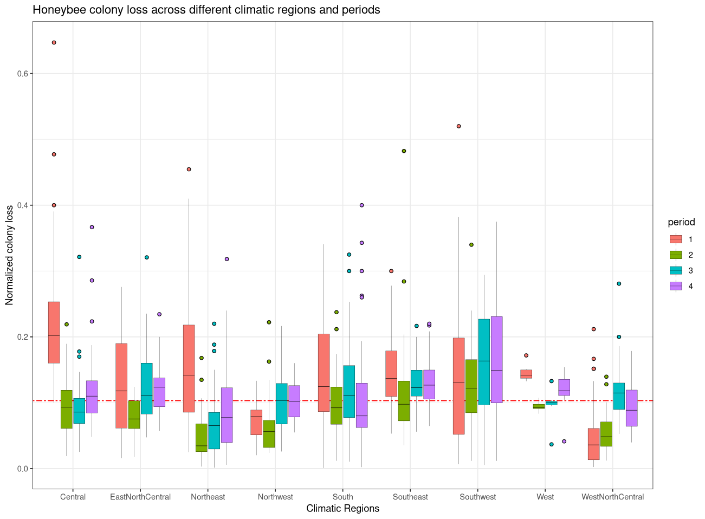

# Homework 2

## Objectives :full_moon_with_face:

The aims of this homework assignment are as follows:

- Learn to program effectively using `if`/`else` statements and iteration structures;
- Become acquainted with using data frame objects and mapping packages;
- Familiarise yourself with GitHub.

## Deadline :alarm_clock:

Submit the homework by Wednesday, 1st November 2023 at 23:59 by pushing to the dedicated repository.

## Requirements :warning:

This homework is **individual** and **must** be completed using the appropriate GitHub template. Please ensure you adhere to the following requirements:

- All commit messages should be clear and meaningful.
- Your GitHub repository must include at least the following:
  - One issue containing some form of **TO DO** list.
  - One pull request, followed by a merge.
  
Progress and organisation (e.g., schedule, subtasks) should be evident in **GitHub Projects**.

You may create one or several RMarkdown files to answer the subsequent problems.

## Content :rocket:

### 1. Inventory Management Simulation

#### Background

You are the inventory manager of a local grocery store named "FreshMart". FreshMart primarily deals in fresh fruits. One of the top-selling fruits is the apple. Due to its popularity, the inventory for apples decreases rapidly. To maintain customer satisfaction, it is essential that FreshMart never runs out of apples.

#### Objective

Your task is to develop a simulation that helps manage the apple inventory. The simulation will run over a period of 52 weeks. Every week:

1. A random number of apples are sold, following a normal distribution with a mean of 100 and a standard deviation of 15. Round the number of apples sold to the nearest integer.
2. If the inventory goes below a threshold of 400 apples and there's no pending order, you should place an order. Note: Only one order can be placed at a time. FreshMart must wait for a delivery before placing another order.
3. Apples ordered take 2 weeks to arrive.

#### Specifications

1. **Initial Inventory**: Start with an inventory of 500 apples.
2. **Sales**: Every week, apples are sold according to the specified distribution. However, if the demand exceeds the available inventory, the sales are limited to the available stock, and FreshMart goes out of stock for the remainder of the week. In addition, a normal distribution is defined on the real line, but the sales should be constrained to be non-negative.
3. **Reorder Point**: If the inventory goes below 400 apples and no order is pending, you should place an order.
4. **Order Quantity**: Whenever you place an order, order 300 apples.
5. **Delivery Time**: It takes 2 weeks for the apples to arrive.
6. **Inventory Check**: At the end of each week, check the inventory. If apples have been ordered and it's their arrival week, add them to the inventory.

#### Tasks

1. Simulate the above scenario for 52 weeks using loops (either `while` or `for`) and `if-else` statements.
2. For each week, store the number of apples sold, deliveries received, and the remaining inventory in separate vectors.
3. At the end of the simulation, provide a summary: total apples sold, total orders placed, and the final inventory count. Additionally, present an annual report in the form of a table where each row corresponds to a week and columns represent the number of apples sold, deliveries received, and the remaining inventory.

Here is an example one such sumulation.

| Week | Apples Sold | Deliveries Received | Remaining Inventory |
|------|-------------|---------------------|---------------------|
| 1    | 92          | 0                   | 408                 |
| 2    | 97          | 0                   | 311                 |
| 3    | 123         | 0                   | 188                 |
| 4    | 101         | 0                   | 87                  |
| 5    | 87          | 300                 | 300                 |
| 6    | 126         | 0                   | 174                 |
| 7    | 107         | 0                   | 67                  |
| 8    | 67          | 300                 | 300                 |
| .    | .           | .                   | .                   |
| 52   | 100         | 0                   | 215                 |

### 2. Honey Bee Colony Loss

#### Background

In this exercise, you'll perform data wrangling operations and create statistical graphs within the context of research on honey bee colony loss. Specifically, you'll replicate one of the graphs from [this paper](https://www.nature.com/articles/s41598-022-24946-4).

Three data sets from the US Department of Agriculture are provided:

- `dat_bee_max` contains the maximum number of colonies for a specified state and period.
- `dat_bee_varroa` details the percentage of colonies affected by the parasitic mite *Varroa destructor* for a specific state and period.
- `dat_bee_loss` enumerates the number of lost colonies for a particular state and period.

Each of these files also includes the year (ranging from 2015 to 2021), the US climatic regions (clusters of US states with shared climatic features as outlined by the National Climate Data Center), and the period (quarters of the year, with the first quarter being January-March).

To load the three data sets into your `R` environment, use `load("dataset.rda")`.

#### Part I

Before merging, the datasets need preprocessing. Some datasets contain duplicates, while others require pivoting. You might also need to transform or rename certain variables. Once these steps are complete, eliminate missing data and non-finite values from the combined dataset. The final dataset should have dimensions $1186 \times 7$. Carry out the necessary data wrangling to achieve a dataset resembling this:

```r
       state year    region period varroa num_lost_colonies num_max_colonies
1      Idaho 2016 Northwest      3  0.253             13000           131000
2 Washington 2018 Northwest      4  0.345             11000            81000
3    Vermont 2015 Northeast      2  0.037               100             6000
4   Virginia 2018 Southeast      2  0.227               500             6000
5    Arizona 2021 Southwest      2  0.074              4300            26000
6    Arizona 2017 Southwest      4  0.616              6500            30000
```

You can use `dplyr` and `tidyr` for data wrangling or stick with base R.

#### Part II

Craft a graph showcasing the empirical distribution of the proportion of honey bee (*Apis mellifera*) colony loss (lost colonies divided by the maximum number of colonies for a given state and period) across quarters (with the first quarter being January-March) and climatic regions. Incorporate a red dashed line to represent the median of the honey bee colony loss proportion. Below is an example:



This graph was produced using `ggplot2`. You can either use `ggplot2` or base R functions. You can either try to reproduce the same graph, or propose a different representation.

### 3. Hilbert Matrix

#### Backgroud

A Hilbert matrix $H$ is a square matrix with elements being the unit fractions. The $i$-th row, $j$-th column element of the matrix $H$ is given by:

$$
H_{i j}=\frac{1}{i+j-1}.
$$

For example, the $5\times5$ Hilbert matrix is:

$$
H = \left[ \begin{array}{ccccc}
1 & 1/2 & 1/3 & 1/4 & 1/5 \\
1/2 & 1/3 & 1/4 & 1/5 & 1/6 \\
1/3 & 1/4 & 1/5 & 1/6 & 1/7 \\
1/4 & 1/5 & 1/6 & 1/7 & 1/8 \\
1/5 & 1/6 & 1/7 & 1/8 & 1/9
\end{array} \right]
$$

#### Exercise

1. Write a function `hilbert_matrix` that computes a Hilbert matrix of `dim_mat` rows and `dim_mat` columns with a single positive integer argument `dim_mat` using `for` loops. Execute `hilbert_matrix(10)`.

2. Modify the body of your function such that:
    - A message is printed in the console before starting to compute the Hilbert matrix;
    - If a positive double is input instead of a positive integer, a warning is issued;
    - If the input is neither a positive double nor a positive integer, an error is issued. Execute `hilbert_matrix(10L)`, `hilbert_matrix(10)`, `hilbert_matrix("10")`.

3. Observe that for an $n \times n$ Hilbert matrix, the numbers appearing in the denominator of each matrix element follow the sequence: $1, \dots, n$ for the first row (or column), $2, \dots, n+1$ for the second row (or column), and so on until $n, \dots, 2n-1$ for the last row (or column). Based on this observation, propose an alternative implementation using the `rep` and `seq` functions without using `for` loops.

4. Compare the performances of your solutions in points 2. and 3. by:
    - Profiling both implementations. Use `profvis::profvis({...})` where `...` is replaced by your code. Comment on the comparison, particularly the memory usage and computation time.
    - Benchmarking both implementations. Use `microbenchmark::microbenchmark({...}, {...})` where `...` should be replaced by your implementations. Discuss the results.
